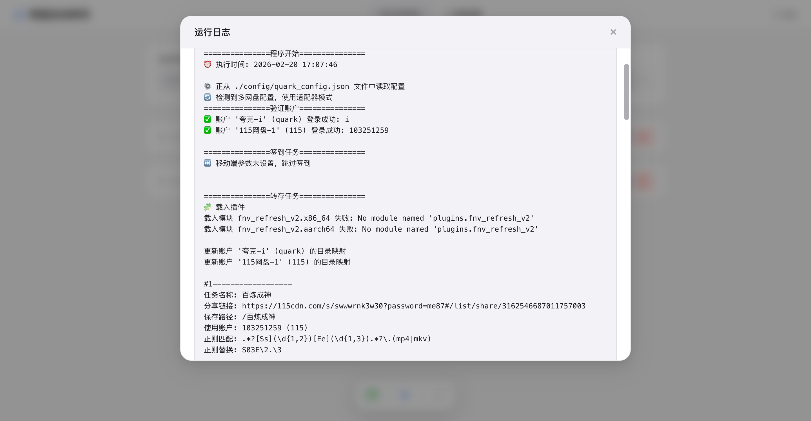
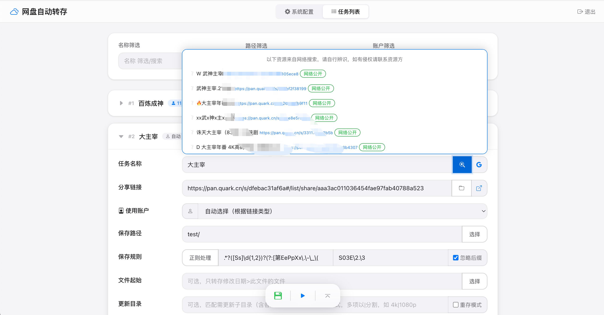
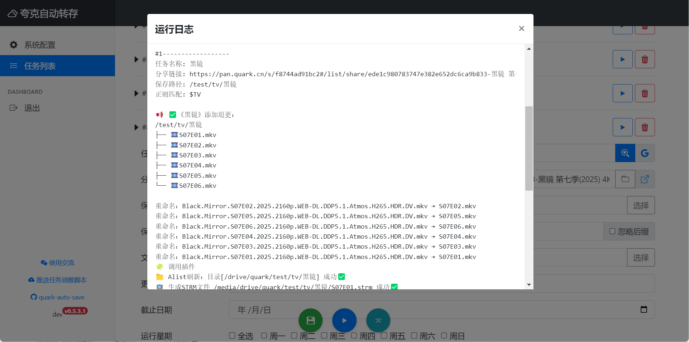

<div align="center">


# 网盘自动转存

网盘签到、自动转存、命名整理、发推送提醒和刷新媒体库一条龙。

基于[Cp0204/quark-auto-save](https://github.com/Cp0204/quark-auto-save)修改，增加多网盘支持，修改前端UI。

[![wiki][wiki-image]][wiki-url] [![github releases][gitHub-releases-image]][github-url] [![docker pulls][docker-pulls-image]][docker-url] [![docker image size][docker-image-size-image]][docker-url]

[wiki-image]: https://img.shields.io/badge/wiki-Documents-green?logo=github
[gitHub-releases-image]: https://img.shields.io/github/v/release/ozoo0/cloud-auto-save?logo=github
[docker-pulls-image]: https://img.shields.io/docker/pulls/ozoo0/cloud-auto-save?logo=docker&&logoColor=white
[docker-image-size-image]: https://img.shields.io/docker/image-size/ozoo0/cloud-auto-save?logo=docker&&logoColor=white
[github-url]: https://github.com/ozoo0/cloud-auto-save
[docker-url]: https://hub.docker.com/r/ozoo0/cloud-auto-save
[wiki-url]: https://github.com/ozoo0/cloud-auto-save/wiki



</div>

> [!CAUTION]
> ⛔️⛔️⛔️ 注意！资源不会每时每刻更新，**严禁设定过高的定时运行频率！** 以免账号风控和给网盘服务器造成不必要的压力。雪山崩塌，每一片雪花都有责任！

> [!NOTE]
> 开发者≠客服，开源免费≠帮你解决使用问题；本项目 Wiki 已经相对完善，遇到问题请先翻阅 Issues 和 Wiki ，请勿盲目发问。

## 功能

- 部署方式
  - [x] 可能~~兼容青龙~~
  - [x] Docker 部署，WebUI 配置

- 网盘支持情况
  - [x] 夸克网盘
  - [x] 115网盘
  - [x] 百度网盘
  - [x] 阿里云盘
  - [x] UC网盘
  - [x] 迅雷网盘(长时间token会过期，待完善！)

- 分享链接
  - [x] 支持分享链接的子目录
  - [x] 记录失效分享并跳过任务
  - [x] 支持需提取码的分享链接 <sup>[?](https://github.com/ozoo0/cloud-auto-save/wiki/使用技巧集锦#支持需提取码的分享链接)</sup>
  - [x] 智能搜索资源并自动填充 <sup>[?](https://github.com/ozoo0/cloud-auto-save/wiki/CloudSaver搜索源)</sup>

- 文件管理
  - [x] 目标目录不存在时自动新建
  - [x] 跳过已转存过的文件
  - [x] 正则过滤要转存的文件名
  - [x] 转存后文件名整理（正则替换）
  - [x] 可选忽略文件后缀

- 任务管理
  - [x] 支持多组任务
  - [x] 任务结束期限，期限后不执行此任务
  - [x] 可单独指定子任务星期几执行

- 媒体库整合
  - [x] 根据任务名搜索 Emby 媒体库
  - [x] 追更或整理后自动刷新 Emby 媒体库
  - [x] 插件模块化，允许自行开发和挂载[插件](./plugins)

- 数据同步
  - [x] 本地目录间文件同步(支持WebDav/FTP等本地挂载之后使用)
  - [x] 支持增量同步和覆盖同步两种模式
  - [x] 支持文件名/去扩展名/MD5 多种匹配模式
  - [x] 支持正则过滤和文件类型过滤
  - [x] 支持定时调度执行
  - [x] MD5 缓存加速，大文件快速指纹优化

- 其它
  - [x] 每日签到领空间 <sup>[?](https://github.com/ozoo0/cloud-auto-save/wiki/使用技巧集锦#每日签到领空间)</sup>
  - [x] 支持多个通知推送渠道 <sup>[?](https://github.com/ozoo0/cloud-auto-save/wiki/通知推送服务配置)</sup>
  - [x] 支持多账号

## 部署

### Docker 部署

Docker 部署提供 WebUI 进行管理配置，部署命令：

```shell
docker run -d \
  --name cloud-auto-save \
  -p 5005:5005 \ # 映射端口，:前的可以改，即部署后访问的端口，:后的不可改
  -e WEBUI_USERNAME=admin \
  -e WEBUI_PASSWORD=admin123 \
  -v ./cloud-auto-save/config:/app/config \ # 必须，配置持久化
  -v ./cloud-auto-save/media:/media \ # 可选，模块alist_strm_gen生成strm使用
  -v /mnt/cloud-drive:/app/datafiles/source \ # 可选，数据同步功能使用，映射网盘目录
  -v /mnt/local-storage:/app/datafiles/dest \ # 可选，数据同步功能使用，映射本地目录
  --network bridge \
  --restart unless-stopped \
  ozoo0/cloud-auto-save:latest
  # registry.cn-hangzhou.aliyuncs.com/cp0204/quark-auto-save:latest # 国内镜像地址
```

docker-compose.yml

```yaml
name: cloud-auto-save
services:
  cloud-auto-save:
    image: ozoo0/cloud-auto-save:latest
    container_name: cloud-auto-save
    network_mode: bridge
    ports:
      - 5005:5005
    restart: unless-stopped
    environment:
      WEBUI_USERNAME: "admin"
      WEBUI_PASSWORD: "admin123"
    volumes:
      - ./cloud-auto-save/config:/app/config
      - ./cloud-auto-save/media:/media
      - /mnt/cloud-drive:/app/datafiles/source  # 可选，数据同步功能使用，网盘挂载点
      - /mnt/local-storage:/app/datafiles/dest  # 可选，数据同步功能使用，本地存储目录
```

管理地址：http://yourhost:5005

| 环境变量         | 默认       | 备注                                     |
| ---------------- | ---------- | ---------------------------------------- |
| `WEBUI_USERNAME` | `admin`    | 管理账号                                 |
| `WEBUI_PASSWORD` | `admin123` | 管理密码                                 |
| `PORT`           | `5005`     | 管理后台端口                             |
| `PLUGIN_FLAGS`   |            | 插件标志，如 `-emby,-aria2` 禁用某些插件 |
| `TASK_TIMEOUT`   | `1800`     | 任务执行超时时间（秒），超时则任务结束   |

**数据同步目录映射说明：**

如需使用数据同步功能，需要额外映射 `datafiles` 目录：

| 挂载点 | 说明 |
|--------|------|
| `/app/datafiles` | 数据同步的基础目录，源目录和目标目录均相对于此路径配置 |

**示例场景：**

1. **网盘挂载同步到本地存储**
   ```yaml
   volumes:
     - ./config:/app/config
     - /mnt/cloud-drive:/app/datafiles/source  # 网盘挂载点
     - /mnt/local-storage:/app/datafiles/dest  # 本地存储目录
   ```
   配置同步任务时：
   - 源目录：`source`
   - 目标目录：`dest`

2. **多目录同步**
   ```yaml
   volumes:
     - ./config:/app/config
     - ./datafiles:/app/datafiles  # 统一挂载父目录
   ```
   在宿主机 `./datafiles/` 下创建子目录（如 `src1`, `src2`, `dest`），配置时填写相对路径即可。

#### 一键更新

```shell
docker run --rm -v /var/run/docker.sock:/var/run/docker.sock containrrr/watchtower -cR cloud-auto-save
```

<details open>
<summary>WebUI 预览</summary>





</details>

## 使用说明

### 正则处理示例

| pattern                                | replace                 | 效果                                                                   |
| -------------------------------------- | ----------------------- | ---------------------------------------------------------------------- |
| `.*`                                   |                         | 无脑转存所有文件，不整理                                               |
| `\.mp4$`                               |                         | 转存所有 `.mp4` 后缀的文件                                             |
| `^【电影TT】花好月圆(\d+)\.(mp4\|mkv)` | `\1.\2`                 | 【电影TT】花好月圆01.mp4 → 01.mp4<br>【电影TT】花好月圆02.mkv → 02.mkv |
| `^(\d+)\.mp4`                          | `S02E\1.mp4`            | 01.mp4 → S02E01.mp4<br>02.mp4 → S02E02.mp4                             |
| `$TV`                                  |                         | [魔法匹配](#魔法匹配)剧集文件                                          |
| `^(\d+)\.mp4`                          | `{TASKNAME}.S02E\1.mp4` | 01.mp4 → 任务名.S02E01.mp4                                             |

更多正则使用说明：[正则处理教程](https://github.com/ozoo0/cloud-auto-save/wiki/正则处理教程)

> [!TIP]
>
> **魔法匹配和魔法变量**：在正则处理中，我们定义了一些“魔法匹配”模式，如果 表达式 的值以 $ 开头且 替换式 留空，程序将自动使用预设的正则表达式进行匹配和替换。
>
> 自 v0.6.0 开始，支持更多以 {} 包裹的我称之为“魔法变量”，可以更灵活地进行重命名。
>
> 更多说明请看[魔法匹配和魔法变量](https://github.com/ozoo0/cloud-auto-save/wiki/魔法匹配和魔法变量)

### 数据同步

支持本地目录间的文件同步功能，适用于网盘挂载目录与本地存储之间的数据同步。

**同步模式：**

| 模式 | 说明 |
|------|------|
| `增量同步` | 跳过已同步的文件，只同步新文件 |
| `覆盖同步` | 始终同步所有文件，覆盖已存在的文件 |

**匹配模式：**

| 模式 | 说明 |
|------|------|
| `文件名匹配` | 根据完整文件名（含扩展名）判断文件是否已存在 |
| `去扩展名匹配` | 根据文件名（不含扩展名）判断文件是否已存在 |
| `MD5 匹配` | 根据文件 MD5 值判断文件是否已存在，可识别重命名文件 |

**配置参数：**

| 参数 | 说明 |
|------|------|
| `源目录` | 同步来源目录的相对路径（相对于 `datafiles/`） |
| `目标目录` | 同步目标目录的相对路径（相对于 `datafiles/`） |
| `正则过滤` | 可选，只同步匹配正则表达式的文件 |
| `文件类型` | 可选，只同步指定类型的文件（视频/音频/图片/文档/字幕） |
| `排除空目录` | 扫描时跳过没有文件的空目录 |
| `MD5 缓存` | 启用 MD5 缓存加速，避免重复计算 |
| `快速指纹阈值` | 大文件使用快速指纹（采样头部/中部/尾部）代替完整 MD5 |
| `并发数` | MD5 计算的并发工作线程数 |

**使用示例：**

同步网盘挂载目录到本地存储：
- 源目录：`test_src`
- 目标目录：`test_dest`
- 同步模式：`增量同步`
- 匹配模式：`文件名匹配`
- 文件类型：`视频`

### 刷新媒体库

在有新转存时，可触发完成相应功能，如自动刷新媒体库、生成 .strm 文件等。配置指南：[插件配置](https://github.com/ozoo0/cloud-auto-save/wiki/插件配置)

媒体库模块以插件的方式的集成，如果你有兴趣请参考[插件开发指南](https://github.com/ozoo0/cloud-auto-save/tree/main/plugins)。

### 更多使用技巧

请参考 Wiki ：[使用技巧集锦](https://github.com/ozoo0/cloud-auto-save/wiki/使用技巧集锦)

## 生态项目

以下展示 QAS 生态项目，包括官方项目和第三方项目。

### 官方项目

* [QAS一键推送助手](https://greasyfork.org/zh-CN/scripts/533201-qas一键推送助手)

  油猴脚本，在夸克网盘分享页面添加推送到 QAS 的按钮

* [SmartStrm](https://github.com/1578411229/SmartStrm)

  STRM 文件生成工具，用于转存后处理，媒体免下载入库播放。

### 第三方开源项目

> [!TIP]
>
> 以下第三方开源项目均由社区开发并保持开源，与 QAS 作者无直接关联。在部署到生产环境前，请自行评估相关风险。
>
> 如果您有新的项目没有在此列出，可以通过 Issues 提交。

* [nonebot-plugin-quark-autosave](https://github.com/fllesser/nonebot-plugin-quark-autosave)

  QAS Telegram 机器人，快速管理自动转存任务

* [Astrbot_plugin_quarksave](https://github.com/lm379/astrbot_plugin_quarksave)

  AstrBot 插件，调用 quark_auto_save 实现自动转存资源到夸克网盘

* [Telegram 媒体资源管理机器人](https://github.com/2beetle/tgbot)

  一个功能丰富的 Telegram 机器人，专注于媒体资源管理、Emby 集成、自动下载和夸克网盘资源管理。


## 声明

本项目为个人兴趣开发，旨在通过程序自动化提高网盘使用效率。

程序没有任何破解行为，只是对于网盘已有的API进行封装，所有数据来自于网盘官方API；本人不对网盘内容负责、不对网盘官方API未来可能的变动导致的影响负责，请自行斟酌使用。

开源仅供学习与交流使用，未盈利也未授权商业使用，严禁用于非法用途。

## Sponsor

CDN acceleration and security protection for this project are sponsored by Tencent EdgeOne.

<a href="https://edgeone.ai/?from=github" target="_blank"></a>